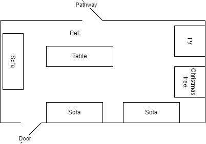
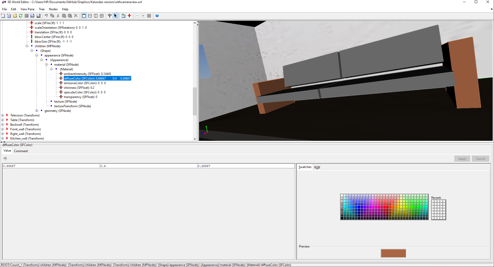
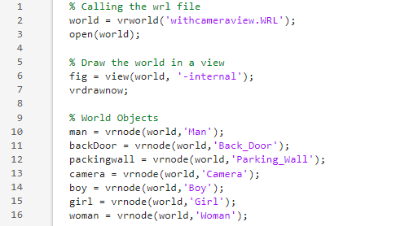
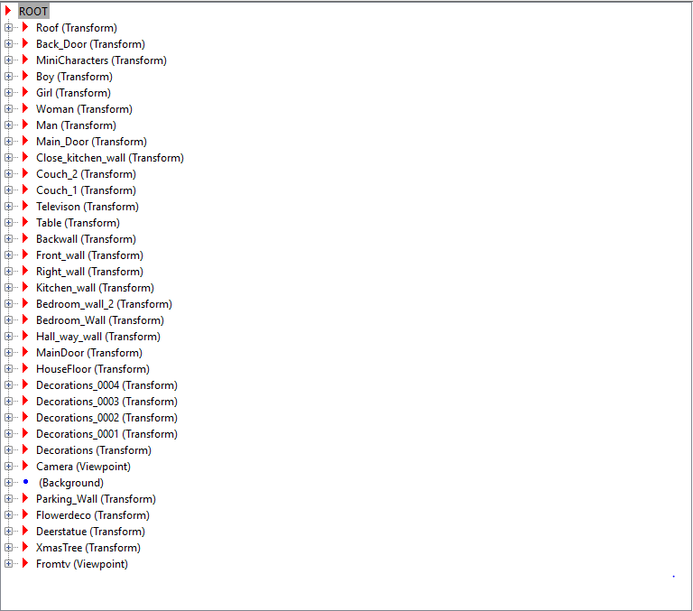
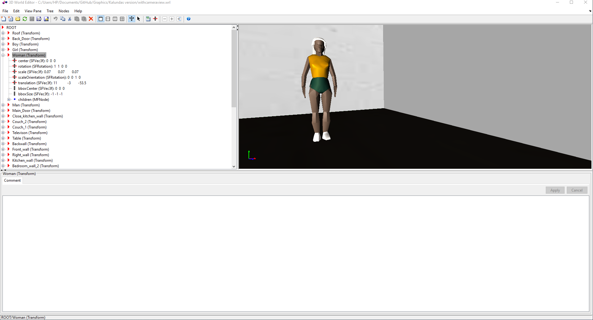
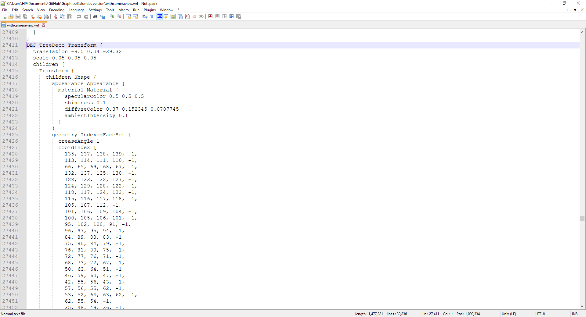

# **FAMILY MOMENTS IN MOTION**

## Introduction

### Background

The focal point was to encapsulate the essence of family time, especially during the enchanting Christmas season. The animation aimed to be a visual narrative that not only showcases the strong bonds within families but also emphasizes themes of love, unity, and shared values.

### Problem Statement

The project identified the weak family bonds caused by multiple factors such as long work hours, separation due to distance, leading to alienation and a lack of self belonging within the family members

### Project Relevance

The project's relevance lies in its advocacy for strengthened family relationships through enhanced communication, shared activities, and a deeper understanding of one another.

### Goals and Significance

The primary goals of the project were to underscore the need for love and unity in a family, accentuate the significance of providing emotional support for each family member, and stress the importance of shared values.

## Objectives

### Overall Objectives

The animation aimed to portray a family of four circling their TV and reminiscing by looking at photos displayed on the TV screen in a warm Christmas-like setting.

The perspective was from a third person’s viewpoint, encompassing various elements such as the family house, TV screen, family members,  and a decorated room with a Christmas tree.

Each family member is animated to do some action to collectively creating a joyful and festive atmosphere.

### Technical Objectives

- Create / add a models (Family members, furniture, decorations etc.)
- Texturise, lighting and colouring according to specifics.
- Scale, translate and transform models accordingly.
- Mobile and static viewpoints.
- Viewpoint positioning and orientation.
- Model translations to animate movement.

### 2D floor sketch

## Approach

### Division of Labour

We split the roles and responsibilities making sure to make use of every person's strength and expertise

(i)Terry Muthoni ([Terry Mukundi](https://github.com/SonnyKundi))-Defining project scope,Animations,Character modelling

(ii)Taylor Omondi ([Taylor-Omondi-Odhiambo](https://github.com/Taylor-Omondi-Odhiambo)) -Requirements gathering,Character modelling,Design review

(iii)Dominic Kimeu ([kimeudom](https://github.com/kimeudom)) - Environment modelling,Overall project animation testing,Design review

(iv)Neville Kalunda ([Kalundaah]([kalundaah (Kalundaah) (github.com)](https://github.com/kalundaah))) -High level design,Animations,Character modelling

(v)Ruai Dak ([ruai-dak](https://github.com/ruai-dak)) -Research review/User research,Environment modelling,Animations

### Gantt chart

### Methodology

The project was done in two phases:
Phase 1 : Establishing fundamental functionality and elements pertaining to family activities

Phase 2:  Refinement - Fine tuning models and animations

The project used MatLab with its internal applications for the development and design of the animation.

Examples of apps to use in MatLab is the 3d World editor.

#### 3D world editor

The 3D world editor was the backbone for the creation of our elements. All the entities and characters were developed there.

The 3D world editor created a vr like world that is saved in a .wrl file. The .wrl file is now called into the MatLab editor as a variable and edited to our specific design.

The wrl files could also be edited through a text editor like Vs Code, Notepad++ and Vim where we dove deeper into the design. In the text based editing, we were able to edit url links to textures, numerical analysis of the shapes of the models etc.

#### Text based editing

![[woman text.PNG]]

### MATLAB files

There was also use of the MATLAB editor to write .m files that was used for spawning and positioning the elements.

The code in the .m file is what renders the world when executed.

#### MATLAB editor

### Development Process

#### 1. Modelled the base assets

We did the creation of models (house, room, table etc.) and characters inside the 3D world editor by changing their appearance, shape, scale (size), translation (position) etc.

 The complete list of created and textured models (a.k.a nodes) is as follows:

##### Character and element Modelling

The following is an example of how we designed the woman character and the decorations.

###### Female model

###### Wall decoration model

#### 2. Implementing Family interaction Logic

Logic for realistic family motions, interactions, and activities was coded and saved in the .m file. This file when run opened the world and edited it as per the expectation of our animation.

These interactions also included the character movements. The following snippet shows how we made the boy character in our animation move towards the rest of the family.

One example is as follows:

##### Walking animation

Creating movement animation frames for the boy model translation

#### 3. Integrate interactive 3D world

Elements facilitating family interactions and dynamics were integrated through addition of camera movement.
The camera was very essential as it showcased the various elements present in the room. The following snippet shows an example of that camera movement as it moves around the room.

##### 3D Viewport movement

#### 4. Refine Models and test

By running the .m files we were able to create animations through camera movements. We then kept adjusting the positions of the characters and models until we felt satisfied with the output.

### Limitations

One specific challenge worth noting was the difficulty in coding characters directly within the MATLAB environment.
Technical hurdles also emerged, particularly in achieving a level of realism deemed satisfactory for the project's objectives.
The project faced a notable dependency on technology.

### Summary

The "Family Time Christmas Animation in MATLAB" project has successfully delivered a poignant and visually appealing animation that effectively captures the spirit of family time during Christmas. The animation serves as a testament to the importance of family bonds and shared experiences.
